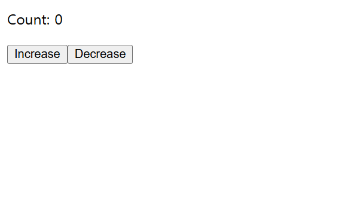
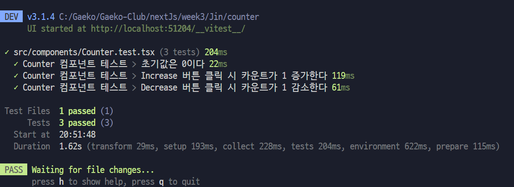

## 간단한 Counter 컴포넌트

- [x] 초기 Count는 0으로 시작되며

- [x] Increase 버튼을 클릭하면 1이 늘어나며

- [x] Decrease 버튼을 클릭하면 1이 줄어든다.

이러한 기능들이 모두 동작하는지 확인하기 위해서 `Counter.test.tsx` 파일이 존재한다.

---

### 테스트 방법

터미널에서 `npx vitest`를 입력 시 테스트가 진행된다.

#### 🔽 테스트를 진행했을 때 모두 통과하는 모습

터미널에서 `npx vitest --ui`를 입력 시 ui에서도 확인이 가능하다.

#### 🔽 ui에서 테스트 결과를 확인하는 모습

