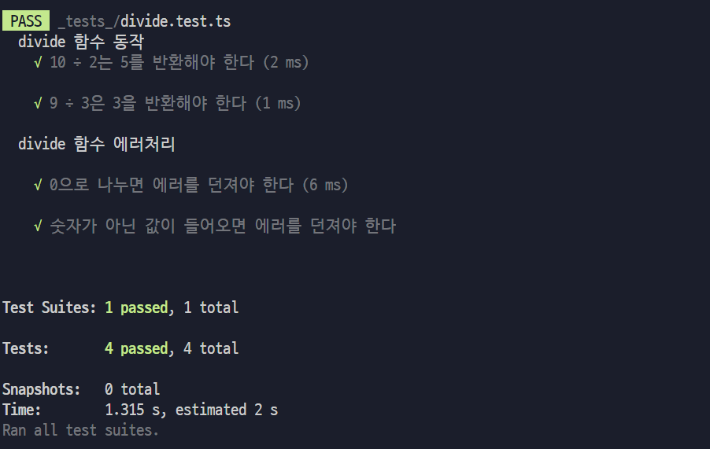

## 간단한 나눗셈 함수

- [x] 2개의 숫자를 받아, 두 숫자를 나눗셈한 결과를 반환한다.

- [x] 나누는 값이 0인 경우 에러를 발생시켜야 한다.

- [x] 숫자가 아닌 값이 주어지면 에러를 발생시켜야 한다.

이러한 기능들이 모두 동작하는지 확인하기 위해서 `divide.test.ts` 파일이 존재한다.

---

### 테스트 방법

터미널에서 `npm test`를 입력 시 테스트가 진행된다.

#### 🔽 테스트를 진행했을 때 모두 통과하는 모습

