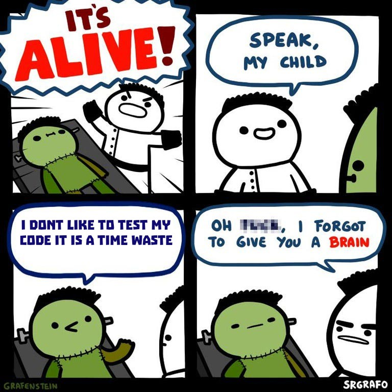
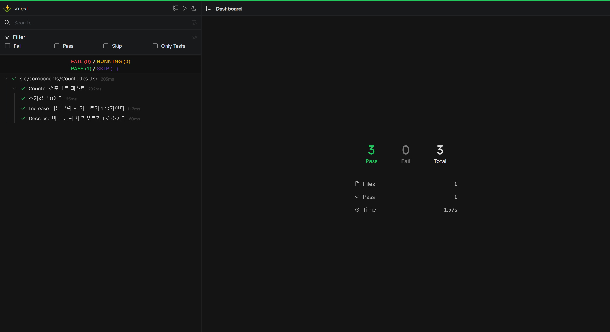
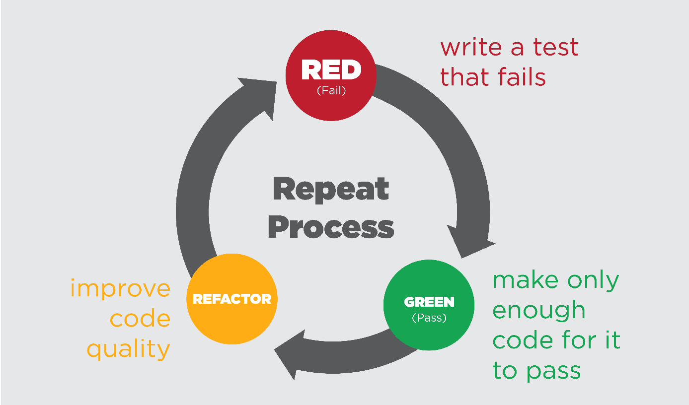

다들 코딩을 진행할 때, 중간중간 잘 실행되는지 확인해본 경험이 있을 것인데,

이런 경우 어떻게 확인하고 넘어가는 편인가?

나는.. 중간중간 `console.log`를 끼워넣어서, 콘솔창에서 확인하는 방법을 많이 활용했다.  
사실 이게 그다지 좋은 방법은 아니라는걸 쓰면서도 느꼈지만, 이것 말고는 잘 모르겠어서 확인이 필요할때마다 `console.log`를 추가하고, 확인하면 다시 지우고.. 이런 과정을 반복한 기억이 있다.  
가끔 까먹고 `console.log`를 삭제하지 않기도 해서, 어쩌다 콘솔을 보면 몇 글자들이 빼꼼 하고있는 경험도 있다.

따라서, 이번 기회에 테스트에 대해서 좀 알아보며, **테스트 코드 작성법, 테스트 진행 방법 및 TDD 방법론**이 무엇인지도 좀 알아보게 되었다.

## 📎테스트의 종류


(예전에 정처기 공부할 때 메모해뒀던 V모델의 흐름 및 테스트 종류...ㅋㅋ)

### 1. Unit Test (단위 테스트)

전체 코드 중 **가장 작은 단위**(함수 또는 React 컴포넌트 등)를 테스트하는 것.

외부 의존성을 제거하고, 테스트하고자 하는 유닛(함수나 컴포넌트)만 독립적으로 실행.

> 하나의 함수, 하나의 클래스, 하나의 컴포넌트  
> 테스트 대상 외의 요소(DB, API 등)는 Mock 처리

### 2. Integration Test (통합 테스트)

**두 개 이상의 유닛**이 함께 작동하는 방식을 테스트하는 것.

예: Form 컴포넌트와 SubmitButton 컴포넌트가 함께 작동할 때 제출이 잘 되는지 확인.

> 유닛 간 상호작용 확인
> 실제 서비스까지 연결하지 않고, 유닛들 간 연결성을 확인

### 3. System Test (시스템 테스트)

애플리케이션이 **완전한 시스템**으로 작동하는지 테스트하는 것.

실제 사용자 플로우처럼 동작: 데이터를 폼에 입력하고, 제출 버튼을 누르면 DB에 저장되는 전체 흐름을 테스트한다.

예: 프로그램에 특정 입력을 주고 전체 소프트웨어가 의도한 결과를 내는지 확인.

> 유저의 관점에서 전체 기능이 정상 작동하는지  
> 유닛 또는 모듈 수준이 아니라, 전체 앱 수준에서 동작 확인

### 4. Acceptance / E2E (End-to-End) Test (인수 / 종단 간 테스트)

실제 사용자 시나리오를 브라우저 환경에서 **처음부터 끝까지 테스트**하는 것.

프론트엔드, 백엔드, DB 등 전체 인프라가 실제로 작동하는 환경에서 테스트한다.

> 구매 → 결제 → 완료 페이지 이동처럼 실제 사용자 행동 흐름 전체를 검증  
> UI 렌더링, API 요청/응답, DB 반영 등 포함

## 📎 테스트 코드 작성법

예를 들어, 카운터 컴포넌트에 대한 테스트를 진행한다고 하자.
이 때 우리는 몇가지 테스트 케이스들을 작성해야 한다.

### describe()

테스트 케이스들을 그룹으로 묶어주는 함수이다.
관련된 테스트들을 한데 모아 테스트 보고서에서 보기 쉽게 해주며, 테스트 구조를 명확히 표현할 수 있다.

```js
describe("Counter 컴포넌트 동작", () => {
  test("초기값은 0이다.", () => {
    /*...*/
  });
  test("+ 버튼 클릭 시 카운트가 1 늘어난다.", () => {
    /*...*/
  });
});
```

### test()

실제 테스트 케이스를 정의하는 함수

```js
test("초기값은 0이다", () => {
  render(<Counter />);
  expect(screen.getByText("Count: 0")).toBeInTheDocument();
});
```

### render()

컴포넌트를 테스트 환경에 렌더링
`render()`를 호출해야 컴포넌트가 가상 DOM에 올라가고, 그 후에 `screen`을 통해 요소를 찾거나 상호작용할 수 있다.
내부적으로 jsdom 환경을 기반으로 작동한다. (브라우저처럼 작동하는 테스트 환경).

```js
render(<Counter />);
```

### screen

`render()`로 렌더링된 가상 DOM에서 특정 요소를 찾기 위한 도구

`getByText`, `getByRole`, `getByTestId` 등 다양한 쿼리 함수들을 제공

| 함수             | 설명                                       |
| ---------------- | ------------------------------------------ |
| getByText()      | 텍스트로 요소 찾기 (정확히 일치)           |
| getByRole()      | 접근성 역할(Role)로 찾기 (button, list 등) |
| getByLabelText() | `<label>`로 연결된 입력 요소 찾기          |
| getByTestId()    | data-testid 속성으로 찾기                  |

```js
screen.getByText("Count: 0");
```

### userEvent

실제 사용자처럼 클릭, 입력 등의 이벤트를 시뮬레이션

비동기 동작을 포함할 수 있기 때문에 await와 함께 사용해야 할 때가 많음

`userEvent.setup()`로 userEvent 인스턴스를 만든 뒤, 메서드를 통해 사용

#### userEvent 인스턴스의 메서드 종류

| 메서드                            | 설명                              | 간단 예시                                        |
| --------------------------------- | --------------------------------- | ------------------------------------------------ |
| `click(element)`                  | 클릭 (마우스 왼쪽 버튼)           | `await user.click(button);`                      |
| `dblClick(element)`               | 더블 클릭                         | `await user.dblClick(button);`                   |
| `type(element, text)`             | 텍스트 입력 (한 글자씩 타이핑)    | `await user.type(input, 'hello');`               |
| `clear(element)`                  | 입력 필드 내용 지우기             | `await user.clear(input);`                       |
| `hover(element)`                  | 마우스 오버 (hover) 이벤트 발생   | `await user.hover(menuItem);`                    |
| `unhover(element)`                | 마우스 포인터 떼기                | `await user.unhover(menuItem);`                  |
| `tab()`                           | 탭 키 누르기 (포커스 이동)        | `await user.tab();`                              |
| `keyboard(text)`                  | 키보드 입력 (특수키 포함 가능)    | `await user.keyboard('{Enter}');`                |
| `selectOptions(element, options)` | `<select>`에서 옵션 선택          | `await user.selectOptions(select, ['option1']);` |
| `upload(element, files)`          | 파일 업로드 (input\[type="file"]) | `await user.upload(fileInput, file);`            |

```js
const user = userEvent.setup();
await user.click(button);
```

### expect

실제로 기대하는 결과를 선언하는 함수
테스트 대상 함수의 반환값이나 상태가 우리가 예상한 대로 나오는지 비교 및 검증

```js
expect(실제값).matcher(기대값);
```

#### 매처(Matcher)의 종류

- .toBe() : 기본 자료형(숫자, 문자열) 값이 정확히 같은지
- .toEqual() : 객체나 배열의 값이 같은지
- .toThrow() : 함수가 예외를 던지는지
- .toHaveTextContent('Hello') : 특정 텍스트가 포함되어 있는지
- .toHaveAttribute('type', 'button') : 특정 속성 값을 가지고 있는지
- .toHaveClass('active') : 특정 클래스를 가지고 있는지
- .toBeInTheDocument() : DOM에 요소가 존재하는지 확인
  (→ @testing-library/jest-dom에서 제공)

```js
expect(button).toHaveTextContent("Click me");
expect(input).toHaveAttribute("placeholder", "이름을 입력하세요");
```

### 🙆‍♂️ 예시 코드

만약 카운터 컴포넌트의 테스트를 진행한다고 했을 때 작성할 수 있는 테스트 코드를 첨부하겠다.

```ts
import { render, screen } from "@testing-library/react";
import userEvent from "@testing-library/user-event";
import Counter from "./Counter";

describe("Counter 컴포넌트 테스트", () => {
  test("초기값은 0이다", () => {
    render(<Counter />);
    expect(screen.getByText("Count: 0")).toBeInTheDocument();
  });

  test("Increase 버튼 클릭 시 카운트가 1 증가한다", async () => {
    render(<Counter />);
    const user = userEvent.setup();

    const increaseBtn = screen.getByRole("button", { name: /increase/i });
    await user.click(increaseBtn);

    expect(screen.getByText("Count: 1")).toBeInTheDocument();
  });

  test("Decrease 버튼 클릭 시 카운트가 1 감소한다", async () => {
    render(<Counter />);
    const user = userEvent.setup();

    const decreaseBtn = screen.getByRole("button", { name: /decrease/i });
    await user.click(decreaseBtn);

    expect(screen.getByText("Count: -1")).toBeInTheDocument();
  });
});
```

## 테스트 진행하기

테스트를 진행하는 방법에는 크게 두 가지 주요 도구(**Jest, Vitest**)가 있다.

### Jest로 테스트 진행

우선 프로젝트에 Jest를 설치한다.
`npm install -D jest`

React 프로젝트라면 Testing Library도 함께 설치한다.
`npm install -D @testing-library/react @testing-library/jest-dom`

이후, jest.config.js 파일을 만들고 아래와 같이 작성한다.

```
module.exports = {
  testEnvironment: "jsdom", // 브라우저 환경에서 테스트
  setupFilesAfterEnv: ["<rootDir>/src/setupTests.ts"] // 테스트 전 설정 파일 경로
};
```

다음으로, setupTests.ts 파일을 아래처럼 추가한다.

```ts
import "@testing-library/jest-dom";
```

이후 테스트를 진행할 컴포넌트와 테스트코드를 작성하고 테스트를 진행한다.

`npm test` : 프로젝트 루트에서 테스트 파일(_.test.ts, _.spec.js 등)을 찾아서 실행하며 한번만 테스트 실행 후 종료된다.

`npm test -- --watch` : 코드 변경 시 자동으로 테스트를 다시 실행한다.

### Vitest로 테스트 진행

우선 프로젝트에 Vitest를 설치한다.  
`npm install -D vitest`

React 프로젝트라면 Testing Library도 함께 설치한다.  
`npm install -D @testing-library/react @testing-library/jest-dom`

이후, vite.config.ts 혹은 vite.config.js에 아래처럼 추가한다.

```ts
import { defineConfig } from "vitest/config";
import react from "@vitejs/plugin-react";

export default defineConfig({
  plugins: [react()],
  test: {
    globals: true, // describe, test, expect를 전역으로 쓰기 위함
    environment: "jsdom", // 브라우저 환경에서 테스트
    setupFiles: "./src/setupTests.ts", // 테스트 전 설정 파일 경로
  },
});
```

다음으로, setupTests.ts 파일을 아래처럼 추가한다.

```ts
import "@testing-library/jest-dom";
```

이후 테스트를 진행할 컴포넌트와 테스트코드를 작성하고 테스트를 진행한다.

`npx vitest` : 프로젝트 루트에서 테스트 파일(_.test.ts, _.spec.js 등)을 찾아서 실행하며, 변경된 파일을 감지해서 자동으로 테스트를 재실행한다.

`npx vitest --run` : 한번만 테스트 실행 후 종료

`npx vitest --ui` : 아래처럼 브라우저에서 볼 수 있는 테스트 실행 결과 화면을 띄워줌


## 📎TDD (Test Driven Development)

### TDD가 무엇인가

코드를 먼저 작성하기 전에, **테스트를 미리 작성**한 뒤, 그에 맞게 코드를 작성하는 것이다.

### TDD의 3단계 사이클



#### 1. Red 🔴 (실패하는 테스트 작성)

먼저 요구사항에 맞는 테스트 코드를 작성한다.
아직 실제 구현이 없기 때문에 당연히 테스트는 **실패(Red)**하게 된다.

#### 2. Green 🟢 (테스트 통과를 위한 코드 작성)

테스트를 통과할 수 있도록 **최소한의 코드**를 작성한다.
이 단계에서는 기능 구현보다는 테스트 통과가 목표

#### 3. Refactor ♻️ (리팩토링)

테스트가 통과한 상태를 유지하면서 코드를 정리한다.
이 과정에서 중복 제거, 가독성 향상, 구조 개선 등이 진행된다.

### TDD와 기존 개발 방식과의 차이

#### 1. 일반적인 개발 방식

- **요구사항 분석 - 설계 - 개발 - 테스트 - 배포** 순으로 이루어진다.
- 허나, 위의 경우 초기에 완벽한 설계를 하기 힘들다. 따라서, 개발 과정에서 잠재적인 버그나 추가 요구사항으로 인한 **재설계**를 진행한다.
- 이 과정에서 **불필요한 코드**가 추가될 수 있다.
- 이는 추후에 코드 관리를 어렵게 하며, 유지보수에도 문제가 생길 수 있다.
- 또한, 사소한 코드 수정에도 모든 부분에 대한 테스트를 진행해야 하므로, 버그의 원인을 찾기 힘들다.

#### 2. TDD 개발 방식

- TDD(Test-Driven Development)는 요구사항에 대한 테스트 코드를 먼저 작성한 뒤, 해당 테스트를 통과할 수 있도록 실제 개발 코드를 작성하는 방식으로 진행된다.
- 개발 순서는 반복되는 **세 단계 사이클**(Red-Green-Refactor) 로 구성된다.
- 이러한 순환적인 개발 방식은 코드 품질을 높이고, 테스트 가능한 작고 명확한 단위로 기능을 쪼개도록 유도한다.
- 또한 테스트 코드는 요구사항의 명세서 역할을 하며, 팀원 간 의사소통 도구로도 활용될 수 있다.

### TDD를 사용하는 이유

TDD에서는 처음에 실패하는 테스트를 먼저 작성한 뒤에 기능을 구현한다. 이 과정에서 무엇을 얻을 수 있을까?

#### 1. 버그 예방과 빠른 발견

테스트 코드를 먼저 작성하므로 개발자는 요구사항을 더욱 명확히 이해하게 되고, 실수하거나 누락하는 부분이 줄어든다.

또한, 테스트 실패가 바로 눈에 보이기 때문에 버그를 초기 단계에서 빠르게 발견하고 수정할 수 있다.

#### 2. 설계 품질 향상

테스트를 먼저 만들려면 기능을 작고 단순하게 나눠야 하므로 자연스럽게 **모듈화**와 **SRP**(Single Responsibility Principle, 단일 책임 원칙)가 지켜지게 되어, 유지보수가 쉬운 구조로 코드가 작성된다.

#### 3. 리팩터링의 안전성

기능 구현 후에도 테스트가 이미 존재하므로, 추후 리팩터링 시 기존 동작이 유지되는지 확인할 수 있다.

#### 4. 문서 역할을 하는 테스트 코드

테스트 코드는 일종의 실행 가능한 요구사항 명세서로도 볼 수 있다.

다른 개발자도 테스트를 읽으면 어떤 기능이 어떤 상황에서 어떻게 동작해야 하는지 쉽게 이해할 수 있다.

## 📎TDD 방법론 실제 사용 예시

간단하게, 나눗셈을 계산해주는 `divide` 함수를 `divide.ts` 파일 내에 구현한다고 해보자.

### 🔴 Red (실패하는 테스트 작성)

나눗셈을 계산해줄 `divide.ts` 파일을 구현하기 전에, 테스트 케이스를 먼저 작성한다.

올바른 동작을 하는지 확인하기 위한 테스트케이스 및 에러 처리를 확인하기 위한 테스트케이스 작성

`divide.test.ts`

```ts
import { divide } from "../divide";

describe("divide 함수 동작", () => {
  test("10 ÷ 2는 5를 반환해야 한다", () => {
    expect(divide(10, 2)).toBe(5);
  });

  test("9 ÷ 3은 3을 반환해야 한다", () => {
    expect(divide(9, 3)).toBe(3);
  });
});

describe("divide 함수 에러처리", () => {
  test("0으로 나누면 에러를 던져야 한다", () => {
    expect(() => divide(10, 0)).toThrow("0으로 나눌 수 없습니다.");
  });

  test("숫자가 아닌 값이 들어오면 에러를 던져야 한다", () => {
    // @ts-expect-error
    expect(() => divide("10", 2)).toThrow("숫자만 입력 가능합니다.");
  });
});
```

### 🟢 Green (테스트 통과를 위한 코드 작성)

이후, 각 테스트를 통과할 수 있도록 divide 함수를 작성

`divide.ts`

```ts
export function divide(a: number, b: number): number {
  if (typeof a !== "number" || typeof b !== "number") {
    throw new Error("숫자만 입력 가능합니다.");
  }

  if (b === 0) {
    throw new Error("0으로 나눌 수 없습니다.");
  }

  return a / b;
}
```

### ♻️ Refactor (리팩토링)

이후 코드를 리팩토링한다.

여기서는 에러 메시지를 상수로 분리하여 리팩토링해봤다.

`divide.ts`

```ts
const ERROR_MESSAGES = {
  NOT_A_NUMBER: "숫자만 입력 가능합니다.",
  DIVIDE_BY_ZERO: "0으로 나눌 수 없습니다.",
};

export function divide(a: number, b: number): number {
  if (typeof a !== "number" || typeof b !== "number") {
    throw new Error(ERROR_MESSAGES.NOT_A_NUMBER);
  }

  if (b === 0) {
    throw new Error(ERROR_MESSAGES.DIVIDE_BY_ZERO);
  }

  return a / b;
}
```

이후 다음 기능을 구현하기 위해 방금과 같은 과정을 반복한다.

## 🍎 마치며

> 작동하지 않는 코드를 작성한 사람을 신뢰하기는 힘들다. 작동하는 깨끗한 코드를 작성하고 자동화된 테스트로 의도를 드러내면, 팀원들이 당신을 신뢰할 근거가 생긴다. - [Extreme Programming](https://search.shopping.naver.com/book/catalog/32462920041?query=%EC%9D%B5%EC%8A%A4%ED%8A%B8%EB%A6%BC%20%ED%94%84%EB%A1%9C%EA%B7%B8%EB%9E%98%EB%B0%8D&NaPm=ct%3Dlogau0z4%7Cci%3Dad40e3a142d8176a451c5b857a7c0203e0c75ea5%7Ctr%3Dboksl%7Csn%3D95694%7Chk%3D96214089973d876791cf7823a66c205a3717c0b0)

테스트를 먼저 작성하는 것은 어색하고 이상할 수 있다. 하지만, 테스트를 먼저 작성함으로써 함께하는 팀원들과 사용자에게 신뢰를 얻을 수 있으므로, TDD를 활용하는 것도 좋은 선택이 될 것이다.
