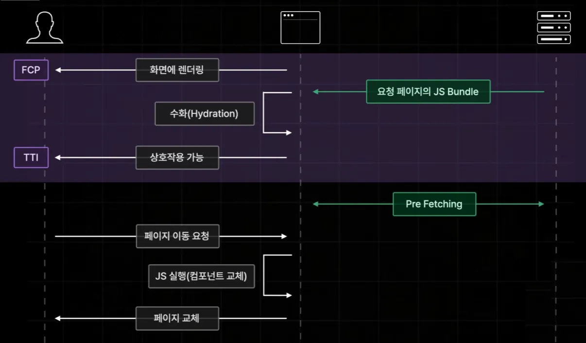

# Next.js 페이지 라우터

Next.js의 구버전 라우팅 방식인 페이지 기반 라우터
정적 라우팅 구조를 기반으로 빠르고 직관적인 페이지 관리가 가능하지만, App Router에 비해 유연함은 떨어지는 편이다.

## 페이지 라우터 개념

- `pages/` 폴더 내의 디렉토리 및 파일 구조가 곧 라우팅 구조가 됨.
- 예를 들어 `pages/about.tsx` → `/about`, `pages/blog/[id].tsx` → `/blog/123`
- 폴더 이름이나 파일 이름만 잘 설정하면 별도의 라우팅 설정 없이 자동으로 라우팅 구성됨.
- SSR(Server-Side Rendering), SSG(Static Generation), ISR(Incremental Static Regeneration) 등 다양한 렌더링 방식과 호환 가능함.

## 프로젝트 시작하기

```bash
npx create-next-app@[버전] [프로젝트명]
```

- 프로젝트 생성 시 App Router를 사용할지 여부를 선택해야 함 → 페이지 라우터 사용하려면 **No** 선택

## 주요 파일 설명

### `_document.tsx`

- HTML 문서의 전체 구조를 커스터마이징하는 용도
- `<html>`, `<head>`, `<body>` 등 직접 수정이 가능함
- 서버 사이드에서만 렌더링되므로 이벤트 핸들링 불가능함

### `_app.tsx`

- 모든 페이지의 공통 entry point
- 페이지 간 전역 상태, 레이아웃, CSS import 등을 여기에 설정함
- `Component`, `pageProps`를 props로 받아서 렌더링하는 방식
- `Component` : 현재 페이지 역할 컴포넌트
- `pageProps` : Component에 전달될 페이지의 props들을 모두 객체로 보관한 것

```tsx
function MyApp({ Component, pageProps }) {
  return <Component {...pageProps} />;
}
```

### `next.config.mjs`

- next 앱 전체 설정을 제어하는 구성 파일

```js
const nextConfig = {
  reactStrictMode: true,
  images: {
    domains: ["example.com"],
  },
};

export default nextConfig;
```

## Query String 및 동적 라우팅 처리

- URL에 붙는 쿼리 파라미터는 `useRouter`로 가져올 수 있음
- 페이지 라우터에서는 반드시 `next/router`에서 import

```tsx
import { useRouter } from "next/router";
const router = useRouter();
const { q } = router.query;
```

- 동적 경로 파일명: `[id].tsx` → `/post/123`에서 `id=123`
- 여러 개의 파라미터를 배열로 받을 때는 `[…slug].tsx` → `/docs/a/b/c` → `slug = ['a', 'b', 'c']` = **Catch All Segment**
- 옵셔널하게 받을 경우: `[[…slug]].tsx` → `/docs` 또는 `/docs/a` = **Optional Catch All Segment**
- 없는 페이지에 접근할 경우 자동으로 `pages/404.tsx` 렌더링됨

---

## 페이지 이동

- `next/link` 컴포넌트를 사용하여 클라이언트 사이드 라우팅 구현
- 브라우저 전체 새로고침 없이 부드러운 페이지 전환이 가능함

```tsx
import Link from "next/link";
<Link href="/about">About</Link>;
```

- 동적으로 이동하려면 `router.push('/about')` 방식 사용

```tsx
import { useRouter } from "next/router";
const router = useRouter();
router.push("/about");
```

## Pre-fetching

사용자가 링크를 클릭하기 전에, 현재 페이지에서 이동이 가능한 모든 페이지들의 데이터들을 미리 다 불러와 놓음으로써 페이지 이동을 빠르게 해주도록 하는 next에서 제공하는 기능

- 필요 없다면 `prefetch={false}` 추가

```tsx
<Link href="/about" prefetch={false}>
  About
</Link>
```

- 직접 프리패칭 하고 싶다면 `router.prefetch('/경로')` 활용

```tsx
useEffect(() => {
  router.prefetch("/about");
}, []);
```

- **주의**: 개발 환경에서는 프리패칭이 작동하지 않음



## API Routes

- Next.js는 백엔드 API 라우트를 `pages/api` 하위에 생성하여 함께 제공함
- 파일 하나당 하나의 API 엔드포인트를 의미함
- 기본적으로 JSON 응답 반환

```tsx
// pages/api/hello.ts
export default function handler(req, res) {
  res.status(200).json({ message: "Hello API" });
}
```

- GET, POST 등 HTTP 메서드 조건 분기 가능
- 인증, DB 연결, 외부 API 호출 등 다양한 로직 처리 가능

## CSS 적용 시 유의사항

- 전역 CSS는 `_app.tsx`에서 한 번만 import 해야 함
- 일반 컴포넌트 내부에서 전역 CSS import 시 빌드 에러 발생
- 모듈 방식 `.module.css` 파일을 활용하는 것이 권장됨

```tsx
import styles from "./MyComponent.module.css";
```

- 컴포넌트 간 스타일 충돌 방지에 효과적

## 레이아웃 적용

- `_app.tsx`에서 공통 레이아웃 래핑 가능
- 아니면 따로 레이아웃용 컴포넌트를 빼서 해당 컴포넌트에 children으로 `<Component {...pageProps} />`를 전달해도 됨

```tsx
function MyApp({ Component, pageProps }) {
  return (
    <Layout>
      <Component {...pageProps} />
    </Layout>
  );
}
```

## 이미지에 흐림 효과 CSS (기록용)

- 배경 위에 어둡고 흐린 오버레이 효과를 주기 위한 css코드드

```css
.cover_img_container {
  display: flex;
  justify-content: center;
  padding: 20px;
  background-position: center;
  background-repeat: no-repeat;
  background-size: cover;
  position: relative;
}

.cover_img_container::before {
  position: absolute;
  top: 0;
  left: 0;
  width: 100%;
  height: 100%;
  background-color: rgba(0, 0, 0, 0.7);
  content: "";
}

.cover_img_container > img {
  z-index: 1;
  max-height: 350px;
  height: 100%;
}
```
