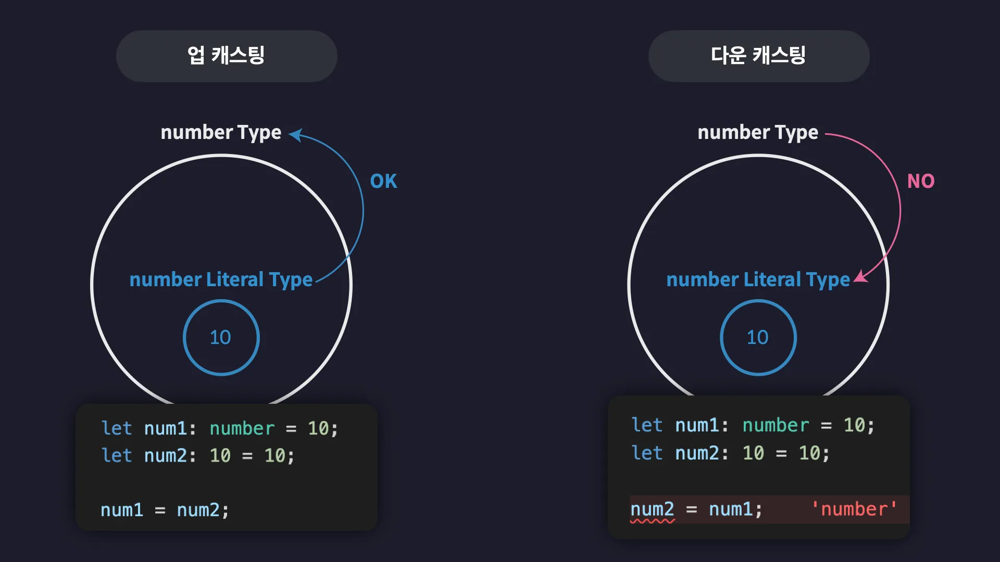
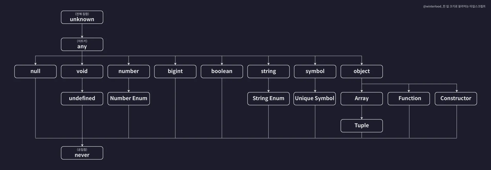

## 타입 호환성

A와 B 두개의 타입이 존재할 때 A 타입의 값을 B 타입으로 취급해도 괜찮은지 판단하는 것

서브 타입의 값을 슈퍼 타입의 값으로 취급하는 것은 **업 캐스팅**

반대는 **다운캐스팅**


## 타입 계층도



### unknown 타입 (전체 집합)

- 타입 계층도 최상단 (모든 타입의 슈퍼타입)

- 모든 타입은 unknown으로 업캐스트 가능

- unknown은 다른 타입으로 다운캐스트 불가 (any 제외)

→ 모든 타입의 부분 집합을 포함하는 전체 집합

```
let a: unknown = 1;  // number -> unknown (ok)
let b: number = a;   // unknown -> number (❌)
```

### never 타입 (공집합)

- 타입 계층도 최하단 (모든 타입의 서브타입)

- never는 모든 타입으로 업캐스트 가능

- 어떤 타입도 never로 다운캐스트 불가

→ 아무 값도 가질 수 없는 불가능을 나타내는 타입

```
function error(): never {
  throw new Error();
}

let a: number = error();  // never -> number (ok)
let b: never = 1;         // number -> never (❌)
```

### void 타입

- undefined와 never의 슈퍼타입

- 주로 "반환 값 없음" 함수의 반환 타입으로 사용

- undefined, never 할당 가능

- 그 외 값은 할당 불가

```
function foo(): void {}
let v: void = undefined;  // ok
```

### any 타입 (치트키)

- 타입 계층도 무시 (모든 타입의 슈퍼이자 서브)

- 모든 타입으로 업/다운캐스트 모두 가능

- 타입 검사 없이 자유롭게 사용 가능 (but, 타입 안전성 ↓)

```
let a: any = 123;
let b: string = a;   // any -> string (ok)
a = b;               // string -> any (ok)
```

## Union 타입

`|` 를 이용하여 유니온 타입을 정의할 수 있다.

`또는` 이라는 뜻을 가지며, 다양한 타입을 지니도록 할 수 있다.

객체에서는 합집합을 의미한다.

```
type Dog = {
  name: string;
  color: string;
};

type Person = {
  name: string;
  language: string;
};

type Union1 = Dog | Person;
```

여기선, Dog 객체 또는 Person 객체 또는 Dog 객체 + Person 객체 를 의미한다.

## Intersection 타입

`&` 를 이용하여 인터섹션 타입을 정의할 수 있다.

`그리고` 라는 뜻을 가지며, 두 타입 간의 교집합을 의미한다.

```
type Dog = {
  name: string;
  color: string;
};

type Person = {
  name: string;
  language: string;
};

type Intersection = Dog & Person;
```

여기선, Dog 객체와 Person 객체를 합친, name, color, language 속성을 모두 가진 타입을 의미한다.
