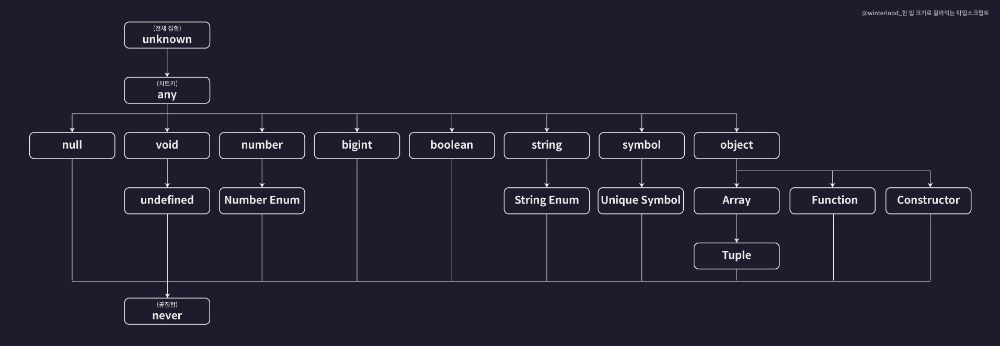

# 타입스크립트 1주차

## 타입스크립트란 무엇인가?

타입스크립트는 자바스크립트의 상위 집합(Superset)으로, 정적 타입(static type)을 지원하는 프로그래밍 언어다.

마이크로소프트에서 개발되었으며, 기존 자바스크립트 코드와 완전히 호환되면서도 컴파일 시점에서 오류를 사전에 방지할 수 있는 강력한 타입 시스템을 제공한다.

타입스크립트는 브라우저가 직접 실행할 수 없기 때문에, 작성한 코드를 자바스크립트로 트랜스파일하여 실행하게 된다.

타입스크립트는 공식문서에 따르면 다음과 같은 목표를 가지고 설계되었다.

1. 대규모 애플리케이션 개발에 적합하다록 타입 시스템과 클래스 기반 객체 지향 기능 제공
2. 자바스크립트와의 완전한 호환성
3. 점진적인 타입 적용이 가능해, 필요한 만큼만 타입을 사용할 수 있음
4. 에디터 자동완성, 타입 추론, 리팩토링 지원 등 개발자 경험 개선

즉, 타입스크립트는 자바스크립트의 자유로움은 유지하면서도, 안정성과 유지보수성을 강화한 언어라고 할 수 있다.

## 타입스크립트의 기본 타입

기본 타입(내장 타입)이란 타입스크립트가 자체적으로 제공하는 가장 기본적인 데이터 타입들을 의미함.
타입스크립트의 기본 타입은 타입 간의 포함 관계에 따라 계층적으로 정리할 수 있다.



### 원시 타입과 리터럴 타입

```tsx
let num: number = 123;
let str: string = "hello";
let bool: boolean = true;
let null1: null = null;
let unde: undefined = undefined;
let numA: 10 = 10; // 리터럴 타입
```

이처럼 타입스크립트는 number, string, boolean, null, undefined와 같은 5가지 원시 타입과 값 그 자체를 타입으로 쓰는 리터럴 타입을 제공한다.

### 배열과 튜플

```tsx
// 배열
let numArr: number[] = [1, 2, 3];
let strArr: Array<string> = ["hello", "im", "min"]; // 제너릭 형식으로 가능

// 튜플: 자바스크립트에 없는 타입스크립트의 특수한 타입으로 길이와 타입이 고정된 배열
let tup1: [number, string, boolean] = [1, "hello", true];
```

### 객체 타입 정의

```tsx
let user: object = {
  // 문제 발생
  id: 1,
  name: "박광민",
};

let user: {
  // 객체 리터럴
  id?: number;
  readonly name: string;
} = {
  id: 2,
  name: "박광민",
};
```

object 타입은 객체라는 것만 알려줄 뿐, 속성에 대한 정보를 알 수 없기 때문에 user.id와 같은 접근이 불가능하다.
반면, 객체 리터럴 형태로 타입을 명확하게 정의하면 각 속성에 안전하게 접근할 수 있어 타입스크립트의 장점을 제대로 활용할 수 있다.

id?: number -> optional(?) 선택적 속성으로 있어도 되고, 없어도 되는 속성이다.
readonly -> 읽기 전용 속성으로 한 번 정의되면 값을 수정할 수 없다.

### 타입 별칭과 인덱스 시그니쳐

```tsx
// 타입 별칭
type User = {
  id: number;
  name: string;
  nickname: string;
  birth: string;
};

let user: User = {
  id: 1,
  name: "박광민",
  nickname: "minimo",
  birth: "1998.10.28",
};

// 인덱스 시그니쳐
type CountryNumberCodes = {
  [key: string]: number;
};
```

타입 별칭은 복잡한 객체 구조를 재사용 가능하도록 이름을 붙여주는 기능이다.
코드의 가독성과 유지보수성을 높일 수 있다.

인덱스 시그니쳐는 객체의 키가 정해지지 않았거나 동적으로 정해지는 경우, 그 키와 값의 타입을 명시적으로 정의할 수 있는 문법이다.

### 열거형 타입

```tsx
enum Role {
  ADMIN = 0,
  USER = 1,
  GUEST = 2,
}
```

enum(열거형)은 관련된 상수들을 하나의 이름 아래 묶어서 의미 있는 값으로 정의할 수 있는 타입이다.

### any, unknown, void, never

```tsx
let num: number = 10;

let anyVar: any = 10;
anyVar = "박광민";
num = anyVar;

let unknownVar: unknown = 10;
unknownVar = "박광민";
num = unknownVar; // 오류

function func(): void {
  console.log("hello");
}

function func2(): never {
  throw new Error();
}
```

any: 모든 타입을 허용하는 특수 타입으로, 타입 검사를 하지 않음. 최대한 사용을 지양하는 것이 좋다.
unknown: 모든 타입의 값을 저장할수 있지만, 사용할 때는 타입 검사 또는 단언이 필요한 안전한 any.
void: 반환값이 없는 함수의 반환 타입에 주로 사용.
never: 절대 반환되지 않는 함수의 반환 타입. 주로 오류 발생 함수에 사용한다.

## 타입은 집합

타입스크립트에서 타입은 값의 집합으로 이해할 수 있다.
예를 들어 number 타입은 모든 숫자 값을 포함하는 집합이고, 10은 그 안에 포함된 하나의 리터럴 타입(부분 집합)이다.

### 타입 호환성

타입 호환성이란 어떤 타입을 다른 타입으로 취급해도 괜찮은지 판단하는 기준이다.

서브타입 → 슈퍼타입 (업캐스팅) : 대부분 허용됨
슈퍼타입 → 서브타입 (다운캐스팅) : 대부분 허용되지 않음 (타입 단언이 필요함)

특수한 경우로,
any 타입은 업캐스팅과 다운캐스팅을 모두 무시한다.
never는 공집합을 의미하는 타입으로, 모든 타입의 서브타입이지만 반대로는 불가능하다.

### 객체 타입의 호환성

```tsx
type Animal = {
  // 슈퍼타입
  name: string;
  color: string;
};

type Dog = {
  // 서브타입
  name: string;
  color: string;
  breed: string;
};

animal = dog; // 가능
dog = animal; // 불가능
```

객체 타입간의 호환성은 속성의 구조(프로퍼티 구성)를 기준으로 판단된다.

### 대수 타입

대수 타입이란 여러개의 타입을 조합하여 새로운 타입을 만드는 방식을 말한다.
대수 타입은 두 가지 형태로 나뉜다:
합집합 타입 (Union Type): A | B — 두 타입 중 하나를 가질 수 있는 타입
교집합 타입 (Intersection Type): A & B — 두 타입을 모두 만족해야 하는 타입

```tsx
// 합집합 타입
let value: string | number;
value = "hello";
value = 123;

//교집합 타입
type Dog = { name: string };
type Cat = { meow: boolean };
type Pet = Dog & Cat;

const pet: Pet = {
  name: "가을이",
  meow: true,
};
```

### 타입 단언

타입 단언이란 개발자가 '이 값은 특정 타입이다' 라고 직접 확신을 가지고 명시하는 문법이다.

타입 단언에는 지켜야 할 조건이 존재한다.
값 as 타입 형식의 단언식을 a as b로 표현했을 때,
다음 두 가지 조건 중 하나를 반드시 만족해야 한다.

1. A가 B의 서브타입이다
2. A가 B의 슈퍼타입이다

즉, A와 B는 타입 계층상 관련이 있어야 하며, 완전히 무관한 타입 간의 단언은 허용되지 않음

```tsx
// 타입 단언
type Dog = {
  name: string;
  color: string;
};

let dog: Dog = {
  name: "돌돌이",
  color: "brown",
  breed: "진도",
} as Dog; // 추가 프로퍼티가 존재하지만 단언하여 검사를 피할 수 있음

// 타입 조건
let num1 = 10 as never; // 가능
let num2 = 10 as unknown; // 가능
let num3 = 10 as string; // 불가능
```
