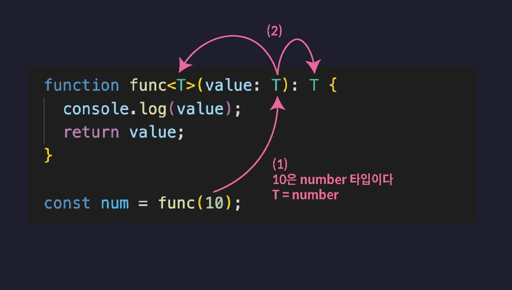

# 타입스크립트 2주차

## 인터페이스

인터페이스는 타입스크립트에서 객체의 구조(Shape)를 정의하기 위한 전용 문법이다.
타입 별칭(type)과 비슷하게 타입에 이름을 붙여 재사용할 수 있지만,
객체 타입 표현에 특화되어 있으며, 상속(extends)이나 선언 병합 등의 고유 기능을 지원한다.

```tsx
// 인터페이스
interface Person {
  name: string;
  age: number;
}

// 메서드 타입 정의하기
interface Person {
  readonly name: string;
  age?: number;
  sayHi: () => void; // 함수 표현식
  // sayHi(): void; // 호출 시그니쳐로 표현 가능
}

// 메서드 오버로딩
interface Person {
  readonly name: string;
  age?: number;
  // sayHi: (a: number, b: number) => void; // 함수 표현식은 불가능
  sayHi(): void; // 호출 시그니쳐만 가능
  sayHi(a: number): void;
  sayHi(a: number, b: number): void;
}

// 주의할 점
// 인터페이스는 Union이나 Intersection 타입을 정의할 수 없다.
type Type1 = number | string;
type Type2 = number & string;

interface Person {
  name: string;
  age: number;
} | number // 불가능

// 타입 별칭과 함께 사용하거나 타입 주석에 직접 사용해야한다.
type Type1 = number | string | Person;
type Type2 = number & string & Person;

const person: Person | string = { // 타입 주석에 활용
  name: "박광민",
  age: 28,
};
```

### 인터페이스 확장

인터페이스 확장(extends)이란, 하나의 인터페이스가 다른 인터페이스로부터 속성과 구조를 상속받아 재사용할 수 있도록 해주는 문법이다.
이를 통해 중복된 프로퍼티 정의를 피하고, 구조를 일관성 있게 유지할 수 있습니다.

```tsx
// 인터페이스 확장
interface Animal {
  name: string;
  color: string;
}

interface Dog extends Animal {
  // extends 앞에는 서브 타입 뒤에는 슈퍼 타입
  breed: string; // 추가 가능
}

interface Cat extends Animal {
  isScratch: boolean;
}

interface Chicken extends Animal {
  isFly: boolean;
}

// 프로퍼티 재정의
interface Dog extends Animal {
  name: "가을이"; // 타입 재 정의
  // name: number 타입 변경은 불가능
  breed: string;
}

// 타입 별칭 확장
type Animal = {
  name: string;
  color: string;
};

interface Dog extends Animal {
  breed: string;
}

// 다중 확장
interface DogCat extends Dog, Cat {}

const dogCat: DogCat = {
  name: "",
  color: "",
  breed: "",
  isScratch: true,
};
```

### 인터페이스 선언 합치기

인터페이스는 동일한 스코프 내에서 중복된 이름으로 선언하면 자동으로 병합된다.
반면, 타입 별칭은 동일한 이름으로 선언하면 오류가 발생함.

```tsx
// 선언 합침
interface Person {
  name: string;
}

interface Person {
  age: number;
}

const person: Person = {
  name: "박광민",
  age: 28,
};

// 주의할 점
interface Person {
  name: string;
}

interface Person {
  name: number; // 다른 타입이라 충돌
  age: number;
}
```

## 클래스

자바스크립트에서 클래스는 동일한 모양의 객체를 더 쉽게 생성하도록 도와주는 문법이다.

타입스크립트에서는 클래스를 필드를 선언할 때, 타입 주석을 명시하거나 초기값을 지정해야 한다.
그렇지 않으면 해당 필드는 암시적으로 any 타입으로 추론되며, 엄격한 타입 검사 모드(strict 옵션이 true로 설정되어 있을 경우)일 때에는 오류가 발생하게 된다.

```tsx
class Employee {
  // 필드
  name: string = "";
  age: number = 0;
  position?: string = "";

  // 생성자
  constructor(name: string, age: number, position: string) {
    this.name = name;
    this.age = age;
    this.position = position;
  }

  // 메서드
  work() {
    console.log("일함");
  }
}

// 클래스는 타입이다.
const employeeC: Employee = {
  name: "",
  age: 0,
  position: "",
  work() {},
};

// 상속
class ExecutiveOfficer extends Employee {
  officeNumber: number;

  constructor(
    // 파생 클래스 생성자 정의
    name: string,
    age: number,
    position: string,
    officeNumber: number
  ) {
    super(name, age, position); // 반드시 super 메서드를 호출해 슈퍼 클래스의 생성자를 호출해야한다. 위치는 최상단
    this.officeNumber = officeNumber;
  }
}
```

### 접근 제어자

접근 제어자(Access Modifier)는 타입스크립트에서만 제공되는 기능
클래스의 특정 필드나 메서드를 접근할 수 있는 범위를 설정하는 기능

1. public: 모든 범위에서 접근 가능, 기본값
2. private: 클래스 내부에서만 접근 가능
3. protected: 클래스 내부 또는 파생 클래스 내부에서만 접근 가능

```tsx
// 필드 생략하기
class Employee {
  // 생성자
  constructor(
    private name: string,
    protected age: number,
    public position: string
  ) {} // 접근 제어자 설정시 this도 생략

  // 메서드
  work() {
    console.log(`${this.name} 일함`);
  }
}
```

### 인터페이스와 클래스

인터페이스를 사용하면 클래스가 가져야 할 속성과 메서드를 미리 정의할 수 있으며, 클래스는 이를 implements 키워드로 구현한다.

```tsx
interface CharacterInterface {
  name: string;
  moveSpeed: number;
  move(): void;
}

class Character implements CharacterInterface {
  constructor(
    public name: string,
    public moveSpeed: number,
    private extra: string
  ) {}

  move(): void {
    console.log(`${this.moveSpeed} 속도로 이동!`);
  }
}
```

## 제네릭

제네릭이란 함수, 인터페이스, 타입 별칭, 클래스 등에 다양한 타입을 유연하게 적용할 수 있도록 해주는 타입스크립트 기능이다.
제네릭을 사용하면 코드의 재사용성과 타입 안정성을 동시에 높일 수 있다.

```tsx
function func<T>(value: T): T {
  return value;
}

let num = func(10); // number 타입

// 예제 1
function swap<T, U>(a: T, b: U) {
  return [b, a];
}

const [a, b] = swap("1", 2); // T는 string U는 number

// 예제 2
function returnFirstValue<T>(data: T[]) {
  return data[0];
}

let num = returnFirstValue([0, 1, 2]);
// number

let str = returnFirstValue([1, "hello", "myname"]); // number | string 유니온 타입

// 예제 3
function returnFirstValue<T>(data: [T, ...unknown[]]) {
  // 튜플 타입의 나머지 요소
  return data[0];
}

let str = returnFirstValue([1, "hello", "myname"]); // number
```



### map, forEach 메서드

map은 자바스크립트의 배열 메서드로 원본 배열의 각 요소에 콜백함수를 수행하고 반환된 값들을 모아 새로운 배열로 만들어 반환한다.

forEach는 배열의 모든 요소에 콜백함수를 한번씩 수행하는 메서드이다.

```tsx
// map 메서드
const arr = [1, 2, 3];
const newArr = arr.map((it) => it * 2); // [2, 4, 6]

// map 메서드 직접 만들기
const arr = [1, 2, 3];

function map<T, U>(arr: T[], callback: (item: T) => U): U[] {
  let result = [];
  for (let i = 0; i < arr.length; i++) {
    result.push(callback(arr[i]));
  }
  return result;
}

map(arr, (it) => it.toString());

// forEach 메서드
const arr2 = [1, 2, 3];

arr2.forEach((it) => console.log(it)); // 출력 : 1, 2, 3

// forEach 메서드 직접 만들기
function forEach<T>(arr: T[], callback: (item: T) => void) {
  for (let i = 0; i < arr.length; i++) {
    callback(arr[i]);
  }
}
```

### 제네릭 인터페이스, 클래스, 타입 별칭

```tsx
// 제네릭 인터페이스
interface KeyPair<K, V> {
  key: K;
  value: V;
}

let keyPair: KeyPair<string, number> = {
  key: "key",
  value: 0,
};

// 인덱스 시그니쳐
interface Map<V> {
  [key: string]: V;
}

let stringMap: Map<string> = {
  key: "value",
};

// 제네릭 타입 별칭
type Map2<V> = {
  [key: string]: V;
};

let stringMap2: Map2<string> = {
  key: "string",
};

// 제네릭 클래스
class List<T> {
  constructor(private list: T[]) {}

  push(data: T) {
    this.list.push(data);
  }

  pop() {
    return this.list.pop();
  }

  print() {
    console.log(this.list);
  }
}

const numberList = new List<number>([1, 2, 3]); // <> 없이 암시적으로 가능하지만 명시하는게 파악하기 좋음
const stringList = new List<string>(["1", "2"]);
```

## 타입 조작

타입 조작이란, 기존에 정의된 타입(기본 타입, 타입 별칭, 인터페이스 등)을 상황에 맞게 유연하게 변형하거나 새로운 타입을 만들어내는 타입스크립트의 강력한 기능이다.

1. 인덱스드 엑세스 타입
2. Keyof 연산자
3. Mapped(맵드) 타입
4. 템플릿 리터럴 타입

### 인덱스드 엑세스 타입

인덱스드 엑세스 타입은 인덱스를 이용해 다른 타입내의 특정 프로퍼티의 타입을 추출하는 타입이다.

```tsx
// 객체 프로퍼티
interface Post {
  title: string;
  content: string;
  author: {
    id: number;
    name: string;
    age: number; // 추가
  };
}

function printAuthorInfo(author: Post["author"]) {
  // [] 안에 타입만 입력 가능
  console.log(`${author.id} - ${author.name}`);
}

// 배열 요소
type PostList = {
  title: string;
  content: string;
  author: {
    id: number;
    name: string;
    age: number;
  };
}[];

const post: PostList[number] = {
  // [] 안에 리터럴 타입도 가능 [0]
  title: "게시글 제목",
  content: "게시글 본문",
  author: {
    id: 1,
    name: "박광민",
    age: 28,
  },
};

// 튜플의 요소
type Tup = [number, string, boolean];

type Tup0 = Tup[0]; // number

type Tup1 = Tup[1]; // string

type Tup2 = Tup[2]; // boolean

type Tup3 = Tup[number]; // number | string | boolean 해당 요소들의 타입을 유니온으로 추출
```

### keyof 연산자

keyof 연산자는 객체 타입으로부터 프로퍼티의 모든 key들을 String Literal Union 타입으로 추출하는 연산자이다.

```tsx
// Keyof 연산자
interface Person {
  name: string;
  age: number;
  location: string; // 추가
}

function getPropertyKey(person: Person, key: keyof Person) {
  return person[key];
}

const person: Person = {
  name: "박광민",
  age: 28,
};

// Typeof와 keyof 함께 사용
function getPropertyKey(person: Person,keyof typeof person) {
  return person[key];
}

const person: Person = {
  name: "박광민",
  age: 28,
};
```

### 맵드 타입

맵드 타입은 기존 객체 타입을 기반으로, 각 속성에 변형을 적용하여 새로운 객체 타입을 생성할 수 있는 타입스크립트의 고급 타입 기능이다.

```tsx
interface User {
  id: number;
  name: string;
  age: number;
}

type PartialUser = {
  [key in keyof User]?: User[key]; // [key in "id" | "name" | "age"]?: User[key];와 같음 keyof 사용하는 게 좋음
};
```

### 템플릿 리터럴 타입

템플릿 리터럴 타입은 타입 조작 기능들 중 가장 단순한 기능으로,
문자열 리터럴 타입들을 조합하여 특정 패턴을 가진 새로운 문자열 타입을 생성할 수 있는 기능이다.

```tsx
type Color = "red" | "black" | "green";
type Animal = "dog" | "cat" | "chicken";

type ColoredAnimal = `${Color}-${Animal}`; // `red-dog` | 'red-cat' | 'red-chicken' | ...; 와 같음
```

## 조건부 타입

조건부 타입은 extends(상속)와 삼항 연산자(?:)를 활용해,
타입이 특정 조건을 만족하는지에 따라 서로 다른 타입을 선택할 수 있도록 해주는 문법이다.

```tsx
// 조건부 타입
type ObjA = {
  a: number;
};

type ObjB = {
  a: number;
  b: number;
};

type B = ObjB extends ObjA ? number : string;

// 제네릭 조건부 타입
type StringNumberSwitch<T> = T extends number ? string : number;
// 조건부 타입은 제네릭과 함께 사용할 때 위력이 극대화됨.
let varA: StringNumberSwitch<number>;
// string

let varB: StringNumberSwitch<string>;
// number
```

### 분산적인 조건부 타입과 infer

분산적인 조건부 타입은 타입스크립트의 조건부 타입에서 발생하는 자동 분해(분산) 현상을 의미한다.

infer는 조건부 타입 내에서 특정 타입을 추론하는 문법이다.

```tsx
// 분산적인 조건부 타입
type StringNumberSwitch<T> = T extends number ? string : number; // extends 앞뒤로 []를 감싸면 분산이 일어나지않음

let a: StringNumberSwitch<number | string>; // string | number

// infer
type ReturnType<T> = T extends () => infer R ? R : never;

type FuncA = () => string; // R 부분에 string이 들어감

type FuncB = () => number;

type A = ReturnType<FuncA>; // string

type B = ReturnType<FuncB>; // number

type C = ReturnType<number>; // 조건식을 만족하는 R추론 불가능 // never
```

## 유틸리티 타입

유틸리티 타입이란 타입스크립트가 자체적으로 제공하는 특수한 타입들이다.

### Partial, Required, Readonly

```tsx
// Partial<T> 특정 객체 타입의 모든 프로퍼티를 선택적 프로퍼티로 바꿔주는 타입
type Result = Partial<{ name: string; age: number }>; // 결과: { name?: string; age?: number }
// Partial<T> = {[key in keyof T]?: T[key];}; 내부 구현 형태

// Required<T> 특정 객체 타입의 모든 프로퍼티를 필수 프로퍼티로 바꿔주는 타입
type Result = Required<{ name?: string; age?: number }>; // 결과: { name: string; age: number }
// Required<T> = {[key in keyof T]-?: T[key];}; 내부 구현 형태

// Readonly<T> 특정 객체 타입의 모든 프로퍼티를 읽기 전용 프로퍼티로 바꿔주는 타입
type Result = Readonly<{ name: string; age: number }>; // 결과: { readonly name: string; readonly age: number }
// type Readonly<T> = {readonly [key in keyof T]: T[key];}; 내부 구현 형태
```

### Record, Pick, Omit

```tsx
// Pick<T, K> 객체 타입 T로부터 지정한 키 K만 골라 새로운 타입을 생성
interface User {
  id: number;
  name: string;
  age: number;
}

type UserName = Pick<User, "name">; // 결과: { name: string }

type UserInfo = Pick<User, "id" | "age">; // 결과: { id: number; age: number }

// 내부 구현 형태
type Pick<T, K extends keyof T> = {
  [P in K]: T[P];
};

// Omit<T, K> 객체 타입 T에서 특정 키 K를 제외한 나머지 속성들로 새로운 타입을 생성
type UserWithoutAge = Omit<User, "age">; // 결과: { id: number; name: string }

// 내부 구현 형태
type Omit<T, K extends keyof any> = Pick<T, Exclude<keyof T, K>>;

// Record<K, V> 키(K)들의 집합을 받아서, 그 모든 키에 대해 값 타입(V)을 동일하게 지정한 객체 타입을 생성
// 일반적인 형태
type Thumbnail = {
  large: {
    url: string;
  };
  medium: {
    url: string;
  };
  small: {
    url: string;
  };
};

// Record로 간결하게 표현
type Thumbnail = Record<"large" | "medium" | "small", { url: string }>; // 동일한 결과: 각 키에 대해 { url: string } 타입이 적용됨

// 내부 구현 형태
type Record<K extends keyof any, V> = {
  [key in K]: V;
};
```

### Exclude, Extract, ReturnType

```tsx
// Exclude<T, K> T로부터 U를 제거하는 타입이다.
type A = Exclude<string | boolean, string>; // 결과: boolean string은 never 공집합이라 제거됨

// 내부 구현 형태
type Exclude<T, U> = T extends U ? never : T;

// Extract<T, K> T로부터 U를 추출하는 타입이다.
type B = Extract<string | boolean, boolean>; // 결과: boolean string은 never 공집합이라 제거됨

// 내부 구현 형태
type Extract<T, U> = T extends U ? T : never;

// ReturnType<T> 타입변수 T에 할당된 함수 타입의 반환값 타입을 추출하는 타입이다.
function funcA() {
  return "hello";
}

function funcB() {
  return 10;
}

type ReturnA = ReturnType<typeof funcA>; // 결과: string 리턴에 "hello"로 string 타입

type ReturnB = ReturnType<typeof funcB>; // 결과: number 리턴에 10으로 number 타입

// 내부 구현 형태
type ReturnType<T extends (...args: any) => any> = T extends (
  ...agrs: any
) => infer R
  ? R
  : never;
```

후기: 모르는 부분이 많다 보니 정리 내용이 많이 길어졌지만 쓰면서 배웠던 내용이 생각났고 쓰기 전과 쓰고 난 후 차이가 확실히 느꼈진 것 같다. 항상 복습을 통해서 공부를 열심히 해야겠다는 생각이 들었고 근본인 js를 잘하면 ts도 쉽게 할 수 있다는 생각이 들었다.
